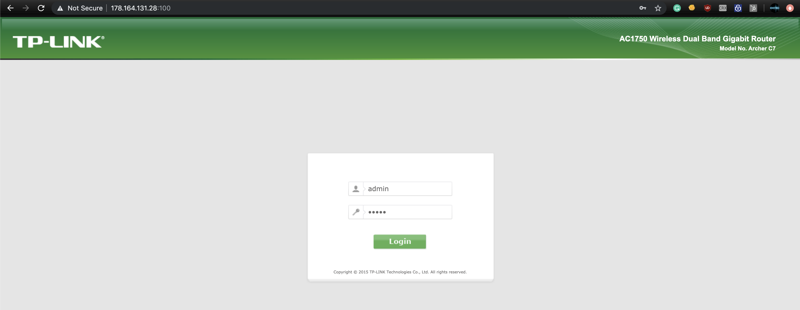

# Escalating TPLink Firmware Vulnerabilities
Script to search for a vulnerability pattern in multiples Firmwares using Ghidra Scripting and Binwalk to extract httpd binary in an automatically way

This tool was designed to search for a vulnerability pattern previously identified in a httpd - Web Servers Binary through multiples firmwares in an automated way.

This tool can be modified to identify vulnerable pattern in different vendors firmware and also in different binaries (not only httpd) this can be done through the modification or creation of new Ghidra Scripts that define the vulnerable pattern to look for.

## httpd_extractor.py
This script will extract the httpd binaries in all the firmwares stored in **Firmwares** folder and will store it into **HTTPD_Binaries** folder.

## analyzer.py
This script will run Ghidra headless analyser in conjunction with the Script stored in **Ghidra_Scripts** folder to identify vulnerability patterns in all the HTTPD Binaries extracted by **httpd_extractor.py**

This script will create pdf files with a map of functions called that identify the vulnerable pattern and will store that results in the folder **Analysis_Results**

### With this tool, I was able to identify that the following devices are affected by CVE-2018-16119 (Authenticated Remote Code Execution) vulnerability that I found in 2018.

## Affected Devices
* TP-LINK WR710
* TP-LINK WDR3500
* TP-LINK Archer C7
* TP-LINK Archer C5
* TP-LINK WR1043ND
* TP-LINK WDR4900

Using Zoomeye.org I was able to determinate that there is a total of **106.966 devices (aprox)** vulnerable exposed to the Internet.

## TODO:
The idea of this research is to find an **Unauthenticated Remote Code Execution** vulnerability affecting a device and use this tool to scale the impact through different devices of the same vendor. This is in order to demonstrate that **conducting research over a cheap device (20 USD) an attacker can affect multiples device exposed to the internet without so much effort and win access from outside to the internal network of a House or a Company or create an IoT Botnet**.

## About the vulnerability:

I found that the HTTPD Binary of the **TP-Link WR1043ND** has a vulnerability in its **NAS** functionality.

When the application gets the user-controlled parameter **shareEntire** when a new folder is created in the **NAS** the function **chkAbsPath** is called and the **shareEntire** content is passed as a parameter of the function as can be seen in the following image:

The function **chkAbsPath** create a fixed buffer called **acStack272** with a size of **260 bytes** and then the controlled parameter **shareEntire** (mapped as **pcParam1** in the code) is used in conjunction with the fixed buffer as parameters of the function **realpath** as can be seen in the following image:

The documentation of **realpath** specify that the function does not control the return value size, due this fact the execution of **realpath** function can derive in a Buffer Overflow.

Due that there is no validation in the code that checks that the length of the user-controlled parameter **shareEntire** is less or equal than 260 bytes (size of **acStack272** buffer) when the **realpath** function is called a Buffer Overflow condition happens.

Understanding this is possible to identify a calling function pattern: If the function chkAbsPath exist and inside a call to **realpath** happens, there is a 90% of possibility that the vulnerability exists.

Due that a vendor uses to reutilise firmware code between different devices. It was really probably that the vulnerability existed in multiples devices, that is why this research happened.

## PoC:
Thanks to these scripts, I was able to identify that the **TP-Link Archer C7 v2** is vulnerable to this exploit, at the moment to write this, I did not have that router but I found one using Zoomeye in Hungary with the following IP: http://178.164.131.28:100

The router allowed access with default credentials: **admin:admin** but I did not want to modify the router settings I wanted to achieve arbitrary code execution in the router in order to **pivot from Internet to the Internal Network where this Hungary's router is part**.

As can be seen in the above image the router has exactly the same firmware version that I identified as vulnerable.

The vulnerability in the Archer C7 v2 firmware can be seen below:

Also, I was able to detect that the vulnerable parameter name: **shareFolderName** as can be seen below:

In the above image the parameter **shareFolderName** is received in **line 254** and the vulnerable function **chkAbsPath** is executed in **line 274**

Additionally, I could identify that the Hungary router had the NAS functionality enable:

When I created a new folder in the router:

The following request was sent and the controllable parameter **shareFolderName**  appeared  as part of the request:

With all this information, I could confirm the vulnerability and I  created the exploit to win access to Hungary's Router internal network

**TODO: CREATE AND ADD EXPLOIT and add Images/Videos of exploitation and reaching internal network**

## More information about the impact of this kind of issues: https://packetstormsecurity.com/files/142321/HackBack-A-DIY-Guide.html
